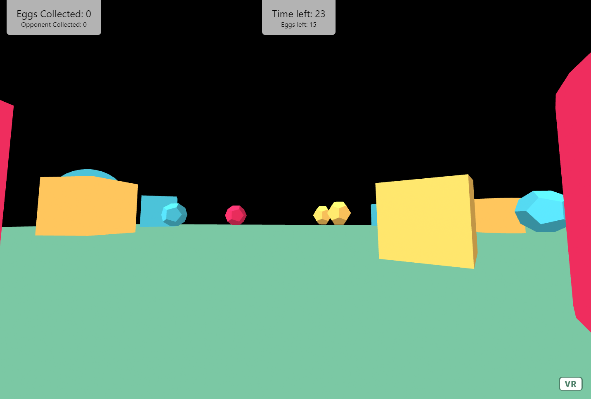

# Egg Hunt

Face against a friend in this timed game of egg-hunting!

There are 15 eggs on the map with 40 seconds on the clock. The game ends when all eggs have been collected. The player who collects the most eggs wins, but if there are any eggs remaining after the time runs out, both players lose!

Playable on **Desktop** and **Mobile**.

**Note:** This game can only be run locally. To have a friend connect to your local server, I suggest using [ngrok](https://ngrok.com/).

## Installing and running

Once you have the files on your computer:

1. Run `npm install`
2. Run `node app`
3. In a separate terminal, navigate to where your [ngrok](https://ngrok.com/) application is saved. Then run `./ngrok http 8080`.
4. Send your friend the `https://` link!

## Built with:

- [A-Frame](https://aframe.io/)
- [A-Frame Extras](https://github.com/n5ro/aframe-extras)
- [A-Frame Physics System](https://github.com/n5ro/aframe-physics-system)
- [Express](https://expressjs.com/)
- [Socket.io](https://socket.io/)
